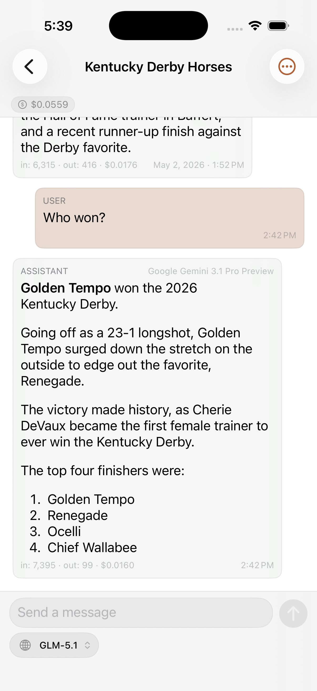
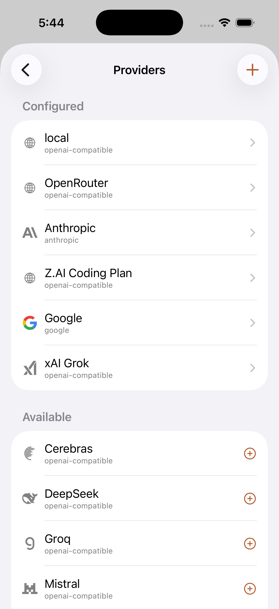

# Spalt

Spalt is a self-hosted AI chat orchestrator. It mixes cloud APIs (Anthropic, OpenAI, Google, OpenRouter, anything OpenAI-compatible) and — eventually — local agentic CLIs behind a single chat UI, with a server that owns history so clients can disconnect and reconnect without losing tokens mid-stream.

It's a personal project. The roadmap, scope, and tradeoffs are biased toward "one developer using this every day," not "platform for many tenants."

> **Human Note:**
>
> Spalt was built to scratch an itch. It's entirely vibe-coded, but I use it frequently and it works well. It's "ChatGPT with any model and provider and a lot of configuration". I make no claims as to the code quality, because I didn't write it, but I did do my best to constrain the architectural path to something which seemed sane to me.

<p align="center">
  
</p>

## Why this exists

Off-the-shelf chat UIs make easy things easy and hard things impossible. Spalt trades polish for knobs:

- **Mix providers in one conversation** — pick the model per turn. Ask Claude for code, hand the result to Gemini for review, settle the dispute with GPT-5.
- **Server-owned streams** — the server consumes upstream provider streams to completion regardless of client state. Background the app, return five minutes later, the message is finished and waiting.
- **Branching message trees** — every conversation is a tree, not a list. Fork from any message; the UI shows sibling counts and lets you switch branches.
- **Manual context compression** — compress on demand into a new context with a summary you can edit before committing.
- **Profiles as configuration bundles** — system message + default model + compression behavior + plugins, attached to a conversation, inheriting from parent profiles.
- **Plugins as compile-time Go code** — one Go interface set covering system-prompt contribution, outgoing rewrites, history transforms, inbound chunk processing, display rewrites, and tools.

## Status

A personal project, exercised daily by the author. Working today:

- Anthropic, OpenAI (Chat Completions + Responses), Google Gemini, and any OpenAI-compatible endpoint, with **13 built-in provider presets** (OpenAI, Anthropic, Google, xAI, DeepSeek, Groq, OpenRouter, Mistral, Together, Cerebras, Qwen, Ollama, Perplexity) each carrying its per-provider quirks.
- Streaming, branching, editing, deleting, and manual two-stage compression.
- Per-message and per-context cost/token tracking, a cache-efficiency dot, prompt caching across Anthropic/OpenAI/Google, and auto-titling via a cheap model (or Apple Foundation Models on macOS).
- Per-conversation overrides (`temperature`, `max_output_tokens`, thinking budget, …) with 4-layer resolution (conversation → profile → model → provider).
- **macOS and iOS** clients (SwiftUI) sharing repositories, view models, and most views via the `SpaltSwift` package; the iOS app reattaches to in-flight server streams on resume and stays readable offline via a SwiftData cache. A server-rendered **web** client is built into spaltd.
- **Tool use end to end** — server-side tools (web search, memory, image generation) and on-device tools (Calendar, Reminders, Health, Obsidian on iOS), with an audit log, per-call permissions, and mid-call elicitation.
- **Semantic history search, MCP, tracing** — opt-in embeddings power a `search_history` tool; a `/mcp` endpoint exposes a curated subset of the API; per-user Langfuse config emits traces.

Deferred: APNs push on iOS, stateful subprocess providers (Claude Code, Codex), multi-user sharing, and encryption-at-rest beyond host disk encryption. See [`docs/`](docs/README.md) for the full picture.

<p align="left">
  
  
</p>

## Architecture

```
┌──────────────┐    ┌────────────────────────┐    ┌──────────────┐
│  Provider    │───▶│  Stream supervisor     │───▶│  Postgres    │
│  (Anthropic, │    │  (goroutine per run)   │    │  stream_runs │
│   OpenAI,    │    │                        │    │  + chunks    │
│   harness…)  │    │  + in-process pub/sub  │    └──────┬───────┘
└──────────────┘    └─────────┬──────────────┘           │
                              │                          │
                              ▼                          │
                       ┌──────────────┐                  │
                       │  Subscribers │◀─────────────────┘
                       │  (clients)   │   (replay from
                       └──────────────┘    sequence N)
```

- **Server** — Go, single binary (`spaltd`), Postgres for storage, ConnectRPC for transport. Model metadata comes from an in-process [models.dev](https://models.dev) catalog, snapshotted onto each model row at provider-add time.
- **Clients** — SwiftUI on macOS 26 / iOS 26 sharing the `SpaltSwift` package (`SpaltKit` + `SpaltUI`), plus a server-rendered web client.
- **No multi-provider framework** — drivers use each vendor's official SDK directly so provider-specific features survive intact; the OpenAI-compatible driver carries a small per-preset `Quirks` overlay.

The full design lives under [`docs/`](docs/README.md), one document per subsystem. Start at [`docs/README.md`](docs/README.md) or [`docs/design/overview.md`](docs/design/overview.md). Read it before working in the repo.

## Repo layout

```
cmd/spaltd/      # server entrypoint
cmd/spalt/       # operator CLI (install, useradd, genkey)
proto/           # ConnectRPC service definitions
gen/             # generated Go bindings (buf)
db/migrations/   # goose-format SQL migrations
internal/        # server packages (auth, conversations, providers, stream, …)
plugins/         # in-tree chat plugins
clients/         # SpaltSwift package + macOS and iOS apps
docs/            # authoritative documentation
```

## Running it

The fastest path is Docker Compose:

```bash
cp .env.example .env        # set POSTGRES_PASSWORD and SPALT_MASTER_KEY
docker compose -p spalt up -d
docker compose -p spalt exec spaltd spalt useradd -u alice
# open http://localhost:8080
```

That's one of three supported ways to run it. The full walkthrough — Docker Compose, a single Docker container against your own Postgres, and from source with `go build` — plus configuration and the clients is in [`docs/operations/installation.md`](docs/operations/installation.md).

Clients: `make mac-app-run` and `make ios-app-run`.

## Development

```bash
make test         # Go suite (unit + pgtestdb integration)
make swift-test   # Swift L1 integration + L2 snapshot
make proto sqlc   # regenerate ConnectRPC and query bindings
```

Build and codegen details are in [`docs/operations/building-and-codegen.md`](docs/operations/building-and-codegen.md); the testing posture in [`docs/testing-plan.md`](docs/testing-plan.md). Adding a provider driver and adding a chat plugin are documented in [`docs/design/providers.md`](docs/design/providers.md) and [`docs/design/plugins.md`](docs/design/plugins.md). `CLAUDE.md` makes test coverage a hard rule: don't merge a vertical slice without tests.

## License

MIT — see [`LICENSE`](LICENSE).
